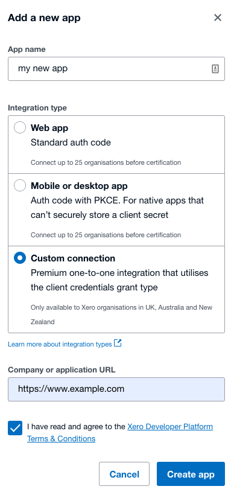
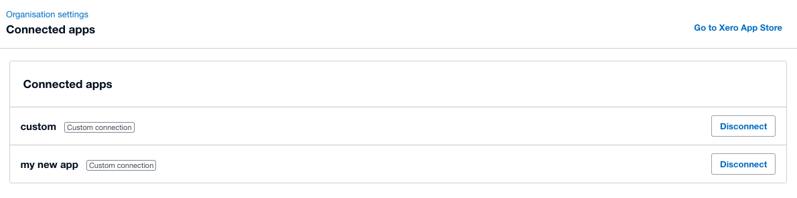
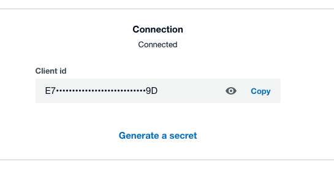
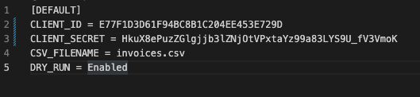

# Void Xero Invoices in Bulk using a Custom Connection

## What does this do?

This tool will bulk void invoices in Xero. All you need is to export the invoices you want gone to a .csv and the code will save you clicking the void drop down menu countless times.

This uses a Custom Connection, Xero Partners and Advisors can add them to client orgs. To learn more about them see [this page](https://developer.xero.com/documentation/guides/oauth2/custom-connections)

## Who can use this?

Organisations based in NZ, AU and UK at the time of writing but subject to change. Please refer to this link to the Xero docs which displays all the options and costs involved [here](https://developer.xero.com/documentation/guides/oauth2/overview/#choose-the-right-authorization-flow-for-your-app)

If you are outside those regions please email Xero and ask them to add your region. My old bulk voiding app + your developer could solve the problem as well.

## Requirements

**Note**: If you aren't a techy person don't worry, this may seem daunting but it's really easy and I believe you can do it! Learning code is fashionable for kids at school nowadays so you'll likely know someone who can help if you do get stuck though.

1) Python
2) Text file editor (Notepad or similar, Visual Studio Code preferred)
3) A terminal (Command prompt on Windows, Terminal on Mac, the built in terminal in VS Code, or similar)

## Instructions

Please refer to my YouTube video [here]() or follow the step by step instructions below:

### Set up a Custom Connection via Xero

They might have their own steps online somewhere, but here's what I did anyway

1. Rename the file in this project named `config.ini_example` to `config.ini`
2. Login to the Developer Portal at `developer.xero.com` then navigate to `https://developer.xero.com/app/manage/`
3. Click `New app` in the top right corner
4. Name your app and choose `Custom connection` for the URL just enter any URL... click `Create app`

5. In the `Scopes` drop down menu select `accounting.transactions`
6. Select your authorised user - I'm going to pick `Current user`
7. Press `Save and connect` in the top right
8. Check your email (or the authorised users' email) and the subject will be `Xero Custom Connection authorization request`
9. Click `Connect` in the email
10. Select your organisation you wish to bulk void in. If it's grey, you need to buy a Custom Connection add-on from Xero
11. Done! You should now see your Custom app connected!

12. Go back to your app at `developer.xero.com` and generate a secret

### Set up the Python void tool

1. Copy paste your client id and client secret from Xero into `config.ini` it should look like this (Note: I've deleted my app so you won't be able to use the example ID or Secret below)

Now the tool is ready to Run!

Other config options:

- `DRY_RUN` when set to `Enabled` nothing will be voided. Set to `Disable` and voiding will happen
- `CSV_FILENAME` needs to match your downloaded .csv file name
- `VOID_TYPE` can be one of `Invoices`, `CreditNotes`. Use `Invoices` when voiding bills and/or invoices in Xero

### Download .csv of documents to void (invoices/bills/etc.)

1. Login to Xero and use the search menu to filter down to the invoices you want to void
2. Click `export` and rename the downloaded .csv file to be `invoices.csv` (if you choose a different name, edit `config.ini` so the names match)
3. Put the file in the same folder as this `README.md` file
4. Run the tool by going:
    - `pip3 install -r ./requrements.txt`
    - `python3 app.py`

## What happened to the old bulk voiding app?

Due to heavy usage I constantly hit the 25 user limit which prevented others from using the app. The application process immediately froze when I requested my app remained free. Since partnered apps follow a cost model I decided to make this instead, for free!

If you preferred the old app that's fine, you can fork the GitHub repo and find someone who can set up a client and get you voiding in house. For now I have decided to stop developing that app because this one is much less code, more simple and achieves the same outcome.

## Disclaimer

This app was solely developed as I am no longer able to progress my certification for the old bulk voiding tool. After writing deprecated on the project and stepping away from it, I couldn't rest well. So I made this. It's not developed or associated with Xero at all.

Voided invoices CANNOT be restored (only copied to a new invoice).

Xero has API rate limits, please respect them. [Xero Limits](https://developer.xero.com/documentation/guides/oauth2/limits/)
